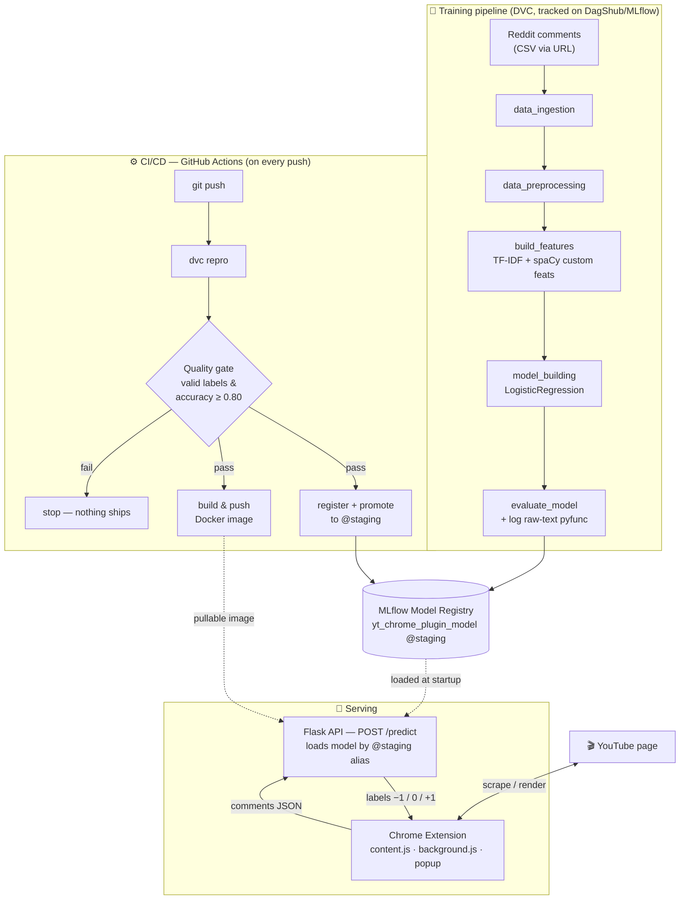

# YouTube Comment Sentiment Analysis — End-to-End MLOps Project


> A 3-class sentiment classifier (**negative · neutral · positive**) for YouTube comments, served through a Flask API and surfaced live in a Chrome extension — wrapped in a full, reproducible **MLOps pipeline** (DVC + MLflow + CI/CD + Docker).

This is my **first end-to-end portfolio project**. The goal was not just to train a model, but to *engineer the whole system around it* the way a real team would: versioned data, tracked experiments, a reproducible pipeline, a gated CI/CD workflow, a model registry, a containerized API, and a browser client that a real user can actually click.

---

## Table of Contents
1. [The Problem](#the-problem)
2. [Demo](#demo)
3. [Architecture](#architecture)
4. [Tech Stack](#tech-stack)
5. [The Machine Learning Journey](#the-machine-learning-journey)
6. [Project Workflow](#project-workflow)
7. [MLOps & Reproducibility](#mlops--reproducibility)
8. [Repository Structure](#repository-structure)
9. [Getting Started](#getting-started)
10. [Challenges](#challenges)
11. [Limitations](#limitations)
12. [Future Work](#future-work)
13. [Related Repositories](#related-repositories)
14. [Author & License](#author--license)

---

## The Problem

Every day, millions of people rely on YouTube to **learn** and creators rely on it to **grow**. Comments hold the collective verdict of the audience — but they're unstructured, endless, and impossible to read in full. Two people feel this pain directly:

**👨‍🎓 The learner.** A student wants to learn a skill from a tutorial. How do they know it's any good *before* spending an hour on it? The comments are the honest signal — but with hundreds or thousands of them, reading 10–20 tells you almost nothing. **This plugin condenses the whole comment section into an at-a-glance sentiment breakdown**, so a learner can quickly judge whether a tutorial is trusted by the people who watched it.

**🎥 The creator.** A creator wants to understand how a video landed. Is the reception mostly positive? Where's the criticism? Manually scrolling doesn't scale. **The plugin gives the creator an instant read of overall sentiment** — how much of the room is positive, neutral, or negative — turning a wall of text into a decision-ready summary.

**The solution:** a machine-learning model that labels each comment as **−1 (negative)**, **0 (neutral)**, or **+1 (positive)**, served over an API and rendered directly on the YouTube page by a Chrome extension.

---

## Demo


>


The Chrome extension scrapes the comments on the current YouTube video, sends them to the prediction API, and renders a sentiment summary (positive / neutral / negative proportions) plus sample comments per class.

---

## Architecture

The system is built as **three decoupled worlds** — training, registry, and serving — joined only by a model alias and an API URL. This separation is deliberate: a new model can be trained and promoted without touching the API, and the API can be redeployed without retraining.



---

## Tech Stack

| Area | Tools |
|------|-------|
| **Language** | Python 3.11, JavaScript (ES6), HTML, CSS |
| **ML / NLP** | scikit-learn, spaCy, NLTK, Optuna (hyperparameter tuning), NumPy, SciPy, pandas |
| **Feature engineering** | TF-IDF, Bag-of-Words, n-grams, custom spaCy linguistic features |
| **Experiment tracking** | MLflow, DagShub (hosted MLflow + DVC remote) |
| **Data & pipeline versioning** | DVC (5-stage reproducible pipeline) |
| **Model registry** | MLflow Model Registry (alias-based promotion) |
| **Visualization / EDA** | matplotlib, seaborn |
| **API / serving** | Flask, flask-cors, waitress (WSGI server) |
| **Browser client** | Chrome Extension API, Manifest V3, content/background scripts |
| **Containerization** | Docker, Docker Hub |
| **CI/CD** | GitHub Actions |
| **Testing / QA** | Postman (manual API testing), pytest-style model gate, ruff (lint + format) |
| **Config / secrets** | python-dotenv, GitHub Actions Secrets |
| **Version control** | Git, GitHub |

---

## The Machine Learning Journey

Reaching the final model was an **iterative, experiment-driven process**, not a single lucky training run. Every experiment was tracked in **MLflow on DagShub** so the whole history is reproducible and comparable.

**What was explored:**

- **Feature representations** — Bag-of-Words vs. **TF-IDF**, and n-gram ranges (unigram, **bigram**, trigram) to capture short negation/intensifier phrases like *"not good"*.
- **~8–9 candidate algorithms** — Logistic Regression, Naive Bayes, Linear SVM, Random Forest, Gradient-Boosted trees, KNN, and others — compared on the same splits.
- **Class imbalance** — the neutral/negative/positive classes are uneven; explored class weighting and resampling strategies.
- **Custom linguistic features** — beyond TF-IDF, engineered **6 text statistics** (length, word count, avg. word length, unique-word count, lexical diversity, POS count) plus **17 spaCy universal-POS proportions**, fused with the sparse TF-IDF matrix.
- **Hyperparameter tuning** — optimized the winning model with **Optuna**.

**The winning model — a "model card":**

| | |
|---|---|
| **Algorithm** | Logistic Regression (elastic-net, `saga` solver) inside a `MaxAbsScaler → LogisticRegression` pipeline |
| **Features** | TF-IDF (1,2-grams) **+** custom spaCy features (6 stats + 17 POS proportions) |
| **Classes** | −1 negative · 0 neutral · +1 positive |
| **Test accuracy** | **0.885** |
| **Macro F1** | **0.875** |
| **Negative-class recall** | 0.77 *(the hardest class — see [Limitations](#limitations))* |
| **Training data** | Reddit comments dataset (public), used as a proxy for social-media sentiment |

Logistic Regression won not because it was the fanciest, but because it was the **best trade-off**: strong accuracy, fast inference (important for a responsive plugin), a small memory footprint, and interpretable behavior — the right engineering choice for the deployment target.

---

## Project Workflow

The project was built in the same order a production ML system would be:

1. **Data collection** — sourced a public labeled comments dataset.
2. **Data preprocessing** — cleaning, normalization, lemmatization, stopword handling (keeping sentiment-bearing words like *not*, *but*, *no*).
3. **Exploratory Data Analysis (EDA)** — class distribution, text-length patterns, vocabulary.
4. **Model building, hyperparameter tuning & evaluation** — with experiment tracking in MLflow.
5. **Building the DVC pipeline** — a reproducible 5-stage DAG.
6. **Registering the model** — as a raw-text MLflow `pyfunc` in the Model Registry, promoted via a `@staging` alias.
7. **Building the API** — a Flask service exposing `POST /predict`.
8. **Developing the Chrome extension** — scrape → call API → render sentiment.
9. **Setting up the CI/CD pipeline** — GitHub Actions.
10. **Testing** — an automated pre-promotion model gate + manual API testing (Postman).
11. **Containerizing** — building the Docker image and publishing it to Docker Hub.

---

## MLOps & Reproducibility

This is the heart of the project — the parts that make it an *engineering* project rather than a notebook.

**🔁 Reproducible pipeline (DVC).** Five stages — `data_ingestion → data_preprocessing → build_features → model_building → evaluate_model` — each with tracked dependencies and outputs. `dvc repro` rebuilds the entire model from scratch, deterministically.

**📊 Experiment tracking & registry (MLflow on DagShub).** Every run's params, metrics, and artifacts are logged. The chosen model is registered under one stable name and promoted to production via an **alias** (`yt_chrome_plugin_model@staging`) — so the API always loads "whatever is currently blessed" without code changes.

**🧠 One source of truth for preprocessing.** Training and inference share a single `inference_utils.py` module (shipped *with* the model via MLflow `code_paths`), eliminating **train/serve skew** — the classic bug where a served model cleans text differently than it was trained on.

**⚙️ Gated CI/CD (GitHub Actions).** On every push to `master`:

```
dvc repro  →  quality gate  →  register + promote  →  dvc push  →  build & push Docker image
```

The **quality gate** re-tests the freshly trained model (valid labels + **accuracy ≥ 0.80**) and *blocks promotion* if it regresses — so a bad model never reaches the plugin. The pipeline also auto-syncs `dvc.lock` back to the repo (GitOps).

**📦 Containerized serving (Docker).** The Flask API is packaged into a Docker image published to Docker Hub (`ranaroy01/yt-sentiment-api`), ready to run anywhere.

---

## Repository Structure

```
yt_comment_analysis/
├── .github/workflows/ci.yaml     # CI/CD: repro → gate → register → dockerize
├── src/
│   ├── data/
│   │   ├── data_ingestion.py     # fetch + split raw data
│   │   └── data_preprocessing.py # clean / normalize / lemmatize
│   ├── features/
│   │   └── build_features.py     # TF-IDF + spaCy custom features
│   └── models/
│       ├── model_building.py     # train LogisticRegression
│       ├── evaluation.py         # evaluate + log the pyfunc model
│       ├── register_model.py     # register + promote to @staging
│       └── inference_utils.py    # shared preprocessing (train == serve)
├── flask_app/
│   └── app.py                    # POST /predict — loads model by alias
├── tests/
│   └── test_model.py             # pre-promotion quality gate
├── dvc.yaml                      # the 5-stage pipeline definition
├── params.yaml                   # pipeline hyperparameters
├── requirements.txt
├── Dockerfile                    # serving image
└── README.md
```

---

## Getting Started

> **Prerequisites:** Python 3.11, Git, and (optionally) Docker Desktop.

**1. Clone & set up the environment**
```bash
git clone https://github.com/Roy7721/yt_comment_analysis.git
cd yt_comment_analysis
python -m venv venv
# Windows: venv\Scripts\activate   |   macOS/Linux: source venv/bin/activate
pip install -r requirements.txt
```

**2. Configure credentials** — create a `.env` (never committed):
```env
MLFLOW_TRACKING_USERNAME=<your-dagshub-username>
MLFLOW_TRACKING_PASSWORD=<your-dagshub-token>
```

**3. Reproduce the full pipeline**
```bash
dvc repro
```

**4. Run the API**
```bash
python flask_app/app.py          # http://127.0.0.1:5000
```

**5. Try a prediction**
```bash
curl -X POST http://127.0.0.1:5000/predict \
     -H "Content-Type: application/json" \
     -d '{"comments": ["this tutorial is amazing", "worst video ever", "it was okay"]}'
```

**6. Or run it in Docker**
```bash
docker build -t yt-sentiment-api .
docker run --rm -p 5000:5000 --env-file .env yt-sentiment-api
```

**7. Load the Chrome extension** — from the [plugin repo](https://github.com/Roy7721/Chrome_plugin): `chrome://extensions` → *Developer mode* → *Load unpacked*.

---

## Challenges

Building a sentiment system for *real-world* YouTube comments surfaces problems a clean dataset hides:

**Data availability & quality**
- No large, general-purpose, publicly labeled **YouTube-comment** dataset (had to use a Reddit proxy).
- **Multi-language** comments — the model is English-only.
- **Spam & bot** comments pollute the signal.
- **Slang, emojis, and informal** text that formal NLP tooling handles poorly.
- **Sarcasm** — "oh great, another 10-minute intro" reads positive lexically but is negative.
- **Evolving language / concept drift** — words flip meaning (e.g., *"sick"* = bad → good).
- **Privacy & data-compliance** considerations around scraping user comments.

**Modeling**
- Data **noise, high variability, and class imbalance** across the three sentiment classes.

**Serving & product**
- **Latency** — predictions must be fast enough to feel instant in the browser.
- **User experience** — turning raw labels into a clear, trustworthy on-page summary.

---

## Limitations

Honest accounting of where this project stands today:

- **Domain shift.** Trained on **Reddit** comments but used on **YouTube** — different tone, length, and vocabulary, so real-world accuracy is lower than the 0.885 test score suggests.
- **Weak neutral / negative boundary.** Negative-class recall (~0.77) is the model's soft spot; subtle or mixed comments get misread. This is partly a **data ceiling**, not just a model flaw.
- **English only** — non-English comments are not handled.
- **No sarcasm/emoji understanding** — a fundamental limit of a linear bag-of-features model.
- **Deployment is local for now.** The API runs locally and as a Docker container, but is **not yet hosted on an always-on cloud URL** (free-tier hosts now require billing verification, and AWS access was unavailable at build time). The image is built and published, ready to deploy the moment resources are available.

---

## Future Work

- **Deep learning** — fine-tune a transformer (e.g., DistilBERT/RoBERTa) for better context, sarcasm, and multilingual handling.
- **Real YouTube training data** — collect and label domain-specific comments to kill the domain shift.
- **Multilingual support.**
- **Cloud deployment** — ship the existing Docker image to a managed host (AWS ECS/App Runner or a PaaS) and point the plugin at a public HTTPS URL.
- **Harden the CI gate** — per-class thresholds, a held-out canary set, and drift monitoring.
- **Spam/bot filtering & emoji handling** in preprocessing.
- **Grow it with a team** — the architecture is intentionally modular so contributors can own the model, API, or plugin independently.

---

## Related Repositories

- 🧩 **Chrome Extension (client):** [github.com/Roy7721/Chrome_plugin](https://github.com/Roy7721/Chrome_plugin)
- 📊 **Experiments & DVC remote (DagShub):** [dagshub.com/Roy7721/yt_comment_analysis](https://dagshub.com/Roy7721/yt_comment_analysis)
- 🐳 **Docker image:** `docker pull ranaroy01/yt-sentiment-api`

---

## Author & License

**Author:** Roy ([@Roy7721](https://github.com/Roy7721))
<!-- TODO: add your full name + LinkedIn / contact if you'd like recruiters to reach you. -->

Released under the **MIT License** — see [LICENSE](LICENSE).

---

<p align="center"><i>Built as a first end-to-end MLOps portfolio project — from raw data to a reproducible, gated, containerized system. Feedback welcome. 💜</i></p>
